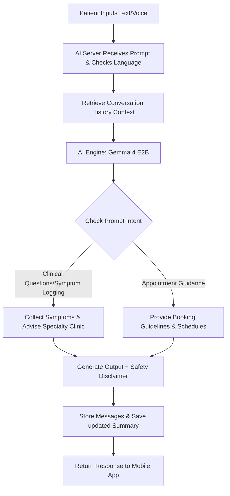
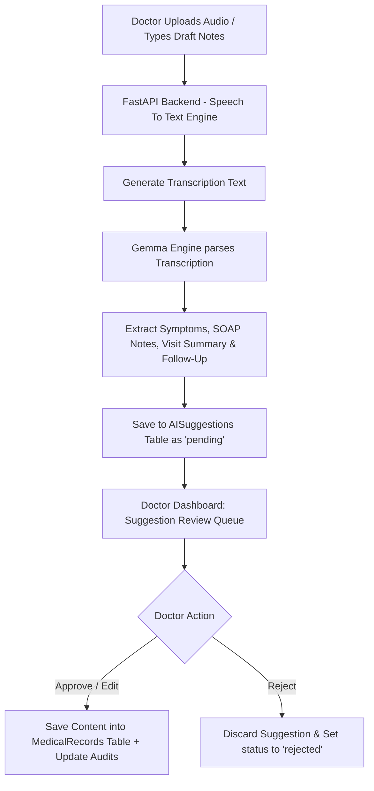
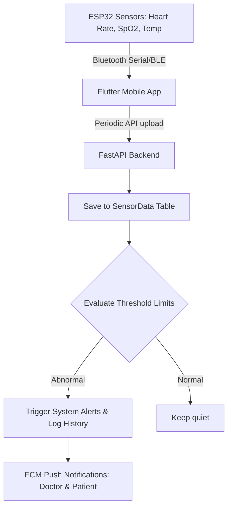

# ============================================================
# SMART CLINIC MANAGEMENT SYSTEM
# ============================================================
# DELIVERY INSTRUCTIONS FOR CLAUDE:
# ─────────────────────────────────────────────────────────────
# 1. Build the COMPLETE application from start to finish.
# 2. Deliver EVERYTHING as a single ZIP file that is ready to run.
# 3. The ZIP must contain:
#    - Full Flutter frontend (Android + iOS + Web)
#    - Full FastAPI backend
#    - Database schema & migration scripts (PostgreSQL / Supabase)
#    - All configuration files (.env.example, docker-compose.yml, etc.)
#    - Setup & run instructions (README.md in Arabic AND English)
# 4. Every single feature described below must be implemented.
#    Do NOT skip or stub any feature.
# 5. The app MUST be bilingual: Arabic (RTL) and English (LTR).
#    The user can switch language at any time from settings.
# 6. The app MUST support Dark Mode and Light Mode.
#    The user can switch theme at any time from settings.
# 7. Use strong, professional UI/UX — this is a medical platform.
#    No placeholder screens. No TODO comments in production code.
# 8. All text strings must be in localization files (not hardcoded).
# 9. Arabic MUST be first-class — not an afterthought.
#    All layouts must flip correctly for RTL.
# 10. Write clean, well-commented, production-quality code.
# ─────────────────────────────────────────────────────────────

==============================================================
PART 1 — PROJECT OVERVIEW, USERS, TECH STACK & CORE MODULES
==============================================================

# 1. PROJECT OVERVIEW

The Smart Clinic Management System is a healthcare platform designed
for a single private clinic.

The system combines:
  - Clinic Management
  - Appointment Management
  - Medical Records
  - Prescriptions
  - AI Medical Assistant
  - IoT Vital Monitoring
  - Reports
  - Notifications

Objective: Improve communication between patients and healthcare
providers while assisting doctors through AI-powered documentation
and patient monitoring.

Constraints:
  - Supports ONE clinic only
  - No multi-branch support
  - No multi-clinic support

---

# 2. SYSTEM USERS

Four user roles exist:

  1. Patient
  2. Doctor
  3. Receptionist
  4. Administrator

Each role has its own permissions and its own dedicated dashboard.

---

# 3. TECHNOLOGY STACK

Frontend:        Flutter
Targets:         Android, iOS, Web

Backend:         FastAPI (Python)
Database:        PostgreSQL
Cloud:           Supabase Compatible
Authentication:  JWT + Refresh Tokens + Google Authentication

AI Engine:       Gemma 4 E2B
AI Architecture:
  - AIProvider (abstract/interface)
  - GemmaProvider (real implementation)
  - MockProvider (for testing/dev)

IoT:             ESP32 over Bluetooth

Notifications:
  - Firebase Cloud Messaging (FCM)
  - Email

Languages:       English + Arabic (both fully supported)
Themes:          Light Mode + Dark Mode

---

# 4. USER ROLE PERMISSIONS

## PATIENT
CAN:
  - Register (email+password, phone+password, Google)
  - Login / Logout
  - Reset Password
  - Complete Profile (required before using any service)
  - Edit Profile
  - Book Appointment
  - View Appointment History
  - View Medical Records (own records only, read-only)
  - View Prescriptions (own prescriptions only, read-only)
  - Upload Documents
  - View Sensor / IoT Data (own data only)
  - Download Reports as PDF
  - Use AI Assistant (symptom checker + guidance only)
  - Receive Notifications

CANNOT:
  - Create or edit diagnoses
  - Create or edit prescriptions
  - Modify medical records

---

## DOCTOR
CAN:
  - Login / Logout
  - View own schedule and appointments
  - View assigned patients
  - Search patients
  - Create and edit diagnoses
  - Create and edit prescriptions
  - Upload files to medical records
  - View IoT sensor data for patients
  - Use AI Assistant (full clinical mode)
  - Review AI suggestions (approve / edit / reject)

CANNOT:
  - Manage users
  - Modify system settings

---

## RECEPTIONIST
CAN:
  - Register new patients
  - Manage appointments (confirm, cancel, reschedule)
  - Manage daily queue
  - Record payments
  - Generate receipts (PDF)
  - View basic statistics

CANNOT:
  - View, create, or edit diagnoses
  - View, create, or edit prescriptions
  - Edit medical records

---

## ADMIN
CAN:
  - Create doctor accounts
  - Create receptionist accounts
  - Manage all users
  - Manage specialties
  - View full reports and analytics
  - Manage system settings

CANNOT:
  - Edit diagnoses
  - Edit prescriptions
  - Edit medical records

---

# 5. AUTHENTICATION MODULE

Patient Registration Methods:
  - Email + Password
  - Phone + Password
  - Google Authentication (OAuth 2.0)

Doctor Registration:      NOT allowed by self-registration
Receptionist Registration: NOT allowed by self-registration
Admin creates doctor and receptionist accounts manually.

Features:
  - Login
  - Logout
  - JWT Authentication
  - Refresh Token mechanism
  - Password Reset (email link)
  - Change Password (when logged in)

---

# 6. PATIENT PROFILE

Required Fields (must be completed before booking):
  - First Name
  - Middle Name
  - Last Name
  - Date of Birth
  - Gender
  - Phone Number
  - Email
  - Address
  - Emergency Contact Name
  - Emergency Contact Phone
  - Blood Type
  - Allergies
  - Chronic Diseases
  - Existing Medical Conditions

Optional:
  - Profile Picture

Profile completion is enforced — the system blocks access to
appointments and services if the profile is incomplete.

---

# 7. APPOINTMENT MANAGEMENT

Appointment Duration: 30 minutes (fixed)

Booking Flow (Patient):
  1. Select Specialty
  2. Select Doctor (filtered by specialty)
  3. Select Date
  4. Select Available Time Slot
  5. Confirm and Submit

Appointment Statuses:
  - Pending    → newly booked, awaiting receptionist confirmation
  - Confirmed  → confirmed by receptionist
  - Completed  → doctor has seen the patient
  - Cancelled  → cancelled by patient or receptionist

Rules:
  - Patient can cancel only BEFORE the appointment start time
  - Receptionist manages all confirmations and cancellations

---

# 8. QUEUE MANAGEMENT

- Receptionist marks patient as "Arrived"
- System auto-generates a queue number
- Doctor Dashboard shows:
    * Current Patient (name + queue number)
    * Next Patient
    * Full waiting queue list

---

# 9. PAYMENT SYSTEM

Supported Methods:
  - Cash
  - Card
  - Mobile Wallet

Payment Record Fields:
  - Amount
  - Payment Method
  - Status
  - Appointment ID (linked)
  - Receptionist ID (who recorded it)

PDF Receipt Generation:
  Receipt must include:
    - Receipt Number (auto-generated)
    - Patient Name
    - Doctor Name
    - Appointment ID
    - Amount
    - Payment Method
    - Date & Time
    - Receptionist Name

---

# 10. MEDICAL RECORDS

Access Rules:
  - Only DOCTORS may create or edit records
  - Patients may VIEW their own records (read-only)
  - Receptionists have NO access to medical records

Medical Record Sections:
  1. Diagnoses
  2. Treatments
  3. Visit Notes
  4. Prescriptions (linked)
  5. Uploaded Files

Diagnosis Fields:
  - Visit Date
  - Chief Complaint
  - Symptoms
  - Diagnosis
  - Severity (mild / moderate / severe)
  - Treatment Plan
  - Notes

SOAP Notes (structured):
  - S — Subjective (patient-reported symptoms)
  - O — Objective (examination findings)
  - A — Assessment (diagnosis)
  - P — Plan (treatment plan)

Audit Trail:
  Every modification to a medical record creates an audit log entry.
  Audit Entry Fields:
    - User (who made the change)
    - Action (created / updated / deleted)
    - Date
    - Time

---

# 11. PRESCRIPTION SYSTEM

Support multiple medications per prescription.

Medication Fields:
  - Medication Name
  - Dosage
  - Frequency
  - Duration
  - Notes

Prescription Statuses:
  - Active
  - Completed
  - Cancelled

PDF Prescription Generation:
  - Must include doctor signature area
  - Patient name, doctor name, date, medications list

---

# 12. AI SYSTEM

Single AI engine with role-aware behavior.

Supports:
  - Arabic and English (both for input and output)
  - Voice input
  - Text input

Storage:
  - Full conversation history is stored per user
  - Conversation summaries are also stored

## PATIENT AI MODE
Functions:
  - Symptom collection through guided conversation
  - General healthcare questions
  - Specialty recommendation ("you should see a cardiologist")
  - Appointment booking guidance

Restrictions:
  - CANNOT diagnose
  - CANNOT prescribe medication

## DOCTOR AI MODE
Input Modes:
  - Audio (speech-to-text, Arabic and English)
  - Text

AI Functions:
  - Speech-to-Text transcription
  - Symptom extraction from conversation/notes
  - SOAP note generation
  - Visit summary generation
  - Follow-up notes generation

Approval Workflow:
  AI generates suggestion
    → Suggestion placed in doctor's queue
    → Doctor reviews suggestion
    → Doctor chooses: Approve / Edit / Reject
    → Only APPROVED content is saved to patient record

This is critical for patient safety — NO AI output enters
a medical record without explicit doctor approval.

---

==============================================================
PART 2 — PATIENT MODULE (Flutter Screens & UX Flows)
==============================================================

# 1. PATIENT APPLICATION

The patient accesses the system via the Flutter mobile application.

Bottom Navigation Bar (always visible):
  - Home
  - Appointments
  - AI Assistant
  - Medical Records
  - Profile

Side Drawer (slide-out menu):
  - Home
  - Appointments
  - Medical Records
  - AI Assistant
  - Sensor Dashboard
  - Notifications
  - Reports
  - Profile
  - Logout

---

# 2. LOGIN SCREEN

Fields:
  - Email or Phone Number (single field, auto-detected)
  - Password

Buttons:
  - Login
  - Login With Google (OAuth)
  - Forgot Password (→ password reset flow)
  - Create Account (→ registration screen)

Validation Rules:
  - Fields cannot be empty
  - Password minimum 8 characters
  - Show inline validation errors

---

# 3. REGISTRATION SCREEN

Fields:
  - First Name
  - Middle Name
  - Last Name
  - Email
  - Phone Number
  - Password
  - Confirm Password

Buttons:
  - Register
  - Back to Login

Validation Rules:
  - Email must be unique in the system
  - Phone must be unique in the system
  - Passwords must match
  - All fields required

Post-Registration:
  → Automatically redirect to Profile Completion screen
  → User cannot skip profile completion

---

# 4. PROFILE COMPLETION SCREEN

Grouped into sections with clear section headers.

Section — Personal Information:
  - First Name
  - Middle Name
  - Last Name
  - Date of Birth (date picker)
  - Gender (dropdown: Male / Female)

Section — Contact Information:
  - Email (pre-filled from registration)
  - Phone Number (pre-filled from registration)
  - Address (text area)

Section — Emergency Contact:
  - Emergency Contact Name
  - Emergency Contact Phone

Section — Medical Information:
  - Blood Type (dropdown: A+, A-, B+, B-, AB+, AB-, O+, O-)
  - Allergies (multi-line text or chip input)
  - Chronic Diseases (multi-line text or chip input)
  - Existing Medical Conditions (multi-line text)

Section — Profile Photo:
  - Optional image upload (camera or gallery)

Buttons:
  - Save (→ proceeds to Home)
  - Cancel (→ logs out, cannot use app without completing)

Enforcement:
  Profile must be 100% complete before any service is accessible.
  Show progress indicator (e.g., "Profile 60% complete").

---

# 5. PATIENT HOME SCREEN

Header Bar:
  - Profile picture (circular avatar, clickable → Profile screen)
  - Patient's full name
  - Notification bell icon (shows badge with unread count)

Dashboard Cards (scrollable vertical list):

  CARD 1 — Upcoming Appointment:
    Displayed only if there is an upcoming appointment.
    Fields:
      - Doctor Name
      - Specialty
      - Appointment Date
      - Appointment Time
    Buttons:
      - View Appointment (→ Appointment Details screen)
      - Cancel Appointment (confirmation dialog)
    If no appointment: show "Book your first appointment" CTA button.

  CARD 2 — Recent Prescription:
    Displayed only if a prescription exists.
    Fields:
      - Prescription Date
      - Prescribing Doctor Name
      - Number of Medications
    Button:
      - View Prescription (→ Prescription PDF viewer)

  CARD 3 — Recent Diagnosis:
    Displayed only if a diagnosis exists.
    Fields:
      - Diagnosis title/name
      - Doctor Name
      - Visit Date
    Button:
      - View Record (→ Medical Record Detail screen)

  CARD 4 — Sensor Summary:
    Displayed only if a Bluetooth sensor device is paired.
    Fields:
      - Heart Rate (bpm) with color-coded status
      - SpO2 (%) with color-coded status
      - Temperature (°C) with color-coded status
    Button:
      - Open Sensors (→ Sensor Dashboard screen)
    If no sensor: show pairing prompt.

  CARD 5 — Recent Notifications:
    Shows the latest 5 notifications.
    Each shows: title, short message, time ago.
    "View All" button → Notifications screen.

---

# 6. APPOINTMENTS SCREEN

Two tabs at the top:
  - Upcoming
  - History

UPCOMING TAB:
  Each appointment card shows:
    - Doctor Name + specialty
    - Date and Time
    - Status badge (Pending / Confirmed)
  Buttons:
    - View Details (→ Appointment Detail screen)
    - Cancel (only if status is Pending or Confirmed AND time not passed)
      Shows confirmation dialog before cancelling.

  Empty state: "No upcoming appointments. Book one now!" + CTA button.

HISTORY TAB:
  Each past appointment card shows:
    - Doctor Name + Specialty
    - Date
    - Status (Completed / Cancelled)
  Button:
    - View Record (→ Medical Record Detail, only if Completed)

  Empty state: "No past appointments yet."

FLOATING ACTION BUTTON:
  "+" icon → Book Appointment flow

---

# 7. BOOK APPOINTMENT SCREEN (Multi-Step Wizard)

Step 1 — Select Specialty:
  - Dropdown or searchable grid of specialty cards
  - Each card: specialty icon + name
  - Button: Next

Step 2 — Select Doctor:
  - Filtered list of doctors in chosen specialty
  - Each doctor card shows:
      * Profile picture
      * Full name
      * Specialty
      * Short bio / experience (optional)
  - Button: Select (highlights selected doctor)
  - Button: Next

Step 3 — Select Date:
  - Full calendar view
  - Available dates highlighted; unavailable dates greyed out
  - User taps a date to proceed

Step 4 — Select Time Slot:
  - Grid of 30-minute time slots for selected date + doctor
  - Available slots: tappable, highlighted in primary color
  - Unavailable slots: greyed out, non-tappable
  - Button: Confirm Appointment

On Confirmation:
  - Appointment created with status = "Pending"
  - Success dialog shown
  - FCM notification sent to patient + receptionist
  - Redirect to Appointments screen

---

# 8. MEDICAL RECORDS SCREEN

Three tabs:
  - Diagnoses
  - Prescriptions
  - Files

DIAGNOSES TAB:
  Each diagnosis card shows:
    - Visit Date
    - Diagnosis title
    - Doctor Name
  Button: View Details (→ Medical Record Detail screen)
  Empty state: "No diagnoses on record."

PRESCRIPTIONS TAB:
  Each prescription card shows:
    - Prescription Date
    - Prescribing Doctor Name
    - Number of medications
    - Status badge (Active / Completed / Cancelled)
  Button: View PDF (opens PDF in app viewer)
  Empty state: "No prescriptions on record."

FILES TAB:
  Each file card shows:
    - File Name
    - File Category (e.g., Lab Result, X-Ray, Report)
    - Upload Date
    - File type icon (PDF, image, etc.)
  Button: View File (opens in-app viewer or downloads)
  Empty state: "No uploaded files."

---

# 9. MEDICAL RECORD DETAIL SCREEN

Shows full read-only view of a single medical record / diagnosis entry.

Fields displayed:
  - Visit Date
  - Doctor Name
  - Chief Complaint
  - Symptoms
  - Diagnosis
  - Severity (shown as colored badge: mild=green, moderate=orange, severe=red)
  - Treatment Plan
  - Notes

SOAP Notes Section (collapsible):
  - S — Subjective
  - O — Objective
  - A — Assessment
  - P — Plan

Linked Prescriptions:
  - List of prescriptions from this visit
  - Each shows medication count + status

Uploaded Files:
  - Files attached to this visit

Button:
  - Download PDF (generates and downloads the full record as PDF)

---

# 10. AI ASSISTANT SCREEN

Layout: Chat-style conversation interface (like WhatsApp/messaging app)

Header:
  - AI Assistant avatar/icon
  - Name: "Smart Clinic AI Assistant"
  - Language toggle (Arabic / English)

Chat Area:
  - Scrollable message bubbles
  - User messages: right-aligned (left-aligned in Arabic)
  - AI messages: left-aligned (right-aligned in Arabic)
  - Timestamps on each message
  - Typing indicator when AI is generating response

Input Area:
  - Text input field (with placeholder text in both languages)
  - Voice input button (hold to record, Arabic + English STT)
  - Send button

AI Capabilities for Patient:
  - Guided symptom collection
  - Healthcare general questions
  - Specialty recommendation ("Based on your symptoms, you may need to see a [specialist]")
  - Appointment booking guidance ("Would you like me to help you book an appointment?")

Strict Restrictions:
  - AI MUST NOT diagnose conditions
  - AI MUST NOT recommend specific medications or dosages
  - AI MUST include a disclaimer in every session:
    "This assistant provides general guidance only. Always consult a doctor for medical advice."

Storage:
  - All messages stored per user with timestamps
  - A summarized version of each conversation is also saved
  - History is accessible from a "Conversation History" button in the header

---

# 11. SENSOR DASHBOARD SCREEN

Only shown when a Bluetooth sensor (ESP32) is paired and connected.
If not connected: show "Connect Sensor Device" screen with pairing instructions.

LIVE READINGS SECTION:
  Three live metric cards, updating in real-time via Bluetooth:

  Heart Rate Card:
    - Current value in BPM (large text)
    - Normal / High / Low status badge
    - Animated heart icon (pulses with reading)
    - Color: green=normal, orange=borderline, red=abnormal

  SpO2 Card:
    - Current value in % (large text)
    - Normal / Low status badge
    - Icon: oxygen/lung
    - Color: green ≥ 95%, orange 90-94%, red < 90%

  Temperature Card:
    - Current value in °C (large text)
    - Normal / Fever / Hypothermia status badge
    - Color coded accordingly

HISTORY SECTION:
  Three tabs: Daily / Weekly / Monthly

  For each tab, display three charts:
    - Heart Rate Chart (line chart over time)
    - SpO2 Chart (line chart over time)
    - Temperature Chart (line chart over time)

  Use fl_chart or similar Flutter chart library.

ALERTS:
  If any reading is abnormal:
    - Show a prominent alert banner at the top
    - Play a subtle notification sound
    - Alert is also sent as FCM notification

---

# 12. NOTIFICATIONS SCREEN

List of all notifications for the patient.

Each notification item shows:
  - Title (bold)
  - Message body
  - Date & time
  - Read / Unread indicator (dot or background color)

Action Buttons per notification:
  - Mark as Read
  - Delete

Bulk Actions:
  - "Mark All as Read" button at top
  - "Delete All Read" button at top

Empty state: "No notifications yet."

---

# 13. PROFILE SCREEN

Displays the patient's full profile in read-only sections.

Section — Personal Information:
  Name, DOB, Gender, Phone, Email, Address

Section — Medical Information:
  Blood Type, Allergies, Chronic Diseases, Existing Conditions

  ⚠️ IMPORTANT: Medical information updates require DOCTOR APPROVAL.
  Patient submits an update request → doctor reviews → approves/rejects.
  Show pending update requests with "Awaiting approval" badge.

Section — Emergency Contact:
  Emergency contact name and phone

Section — Uploaded Files:
  List of documents patient has uploaded (lab results, etc.)
  Each: file name, category, date, view/download button

Button:
  - Edit Profile (opens editable form for non-medical fields)
  - Submit Update Request (for medical information changes)

---

# 14. REPORTS SCREEN

Patient Summary Report:

Content included in PDF:
  - Personal Information (name, DOB, blood type, contact)
  - Diagnoses history (all visits)
  - Prescriptions history (all prescriptions)
  - Visits summary (dates, doctors, outcomes)
  - Sensor Data summary (averages, peaks, alerts if any)

Report Display:
  - Preview on screen before downloading

Button:
  - Download PDF (generates PDF and saves to device / offers share)

Date Range Filter:
  - Allow patient to select start date and end date for report period

==============================================================
PART 3 — DOCTOR MODULE (Flutter Screens & UX Flows)
==============================================================

# 1. DOCTOR APPLICATION

The doctor accesses the system via the Flutter app (mobile + web).

Bottom Navigation Bar:
  - Dashboard
  - Appointments
    - Patients
  - AI Assistant
  - Profile

---

# 2. LOGIN SCREEN

Fields:
  - Email
  - Password

Buttons:
  - Login
  - Forgot Password

First Login Rule:
  - If it is the doctor's first login (account created by admin),
    the system MUST force an immediate password change before
    allowing access to any other screen.
  - First-login flag is stored in the database and cleared after
    the password is successfully changed.

---

# 3. DOCTOR DASHBOARD

Header:
  - Doctor's full name
  - Specialty badge
  - Profile photo (circular avatar)
  - Notification bell with unread badge

Dashboard Cards (scrollable):

  CARD 1 — Today's Appointments:
    - Total appointment count for today
    - Quick list: patient name + time for each appointment
    - Tap any appointment → Appointment Detail

  CARD 2 — Waiting Queue:
    - Current Patient (name + queue number, highlighted)
    - Next Patient (name + queue number)
    - Total waiting count
    - "Start Consultation" button for current patient

  CARD 3 — Recent Diagnoses:
    - Last 3–5 diagnoses created by this doctor
    - Each: Patient Name + Diagnosis title + Visit Date
    - Tap → Patient Medical Record Detail

  CARD 4 — Sensor Alerts:
    - Active alerts from patients with connected ESP32 sensors
    - Each alert: Patient Name + Alert Type (e.g., High Heart Rate)
      + timestamp
    - Color-coded by severity (orange / red)
    - Tap → Patient Sensor Monitoring screen

  CARD 5 — Notifications:
    - Latest 5 notifications
    - Each: title + short message + time ago
    - "View All" → Notifications screen

---

# 4. APPOINTMENTS SCREEN

Three tabs:
  - Today
  - Upcoming
  - Completed

Each appointment card shows:
  - Patient Name
  - Appointment Date + Time
  - Status badge (Pending / Confirmed / Completed / Cancelled)

Buttons per card:
  - Open Patient (→ Patient Details screen)
  - Start Consultation (→ Consultation screen, only for Confirmed/today)

Filtering:
  - Each tab filters appointments by date/status automatically
  - Search bar at top to filter by patient name within the tab

Empty state per tab:
  - "No appointments today." / "No upcoming appointments." etc.

---

# 5. PATIENT SEARCH SCREEN

Accessible from the Patients tab in bottom nav.

Search Bar:
  - Search by Patient Name (first, middle, or last)
  - Search by Phone Number

Results List:
  Each result card shows:
    - Patient Full Name
    - Age (calculated from DOB)
    - Gender
    - Profile photo thumbnail
  Button: Open Profile (→ Patient Details screen)

Empty / No Results state:
  - "No patients found. Try a different search."

Recent Patients Section:
  - Below search, show recently viewed patients (last 5)
  - Each: name + last visit date

---

# 6. PATIENT DETAILS SCREEN

Header Section:
  - Profile photo
  - Full Name
  - Age
  - Gender
  - Blood Type (badge)

Medical Summary Section (always visible):
  - Allergies (chip list, highlighted in orange if any)
  - Chronic Diseases (chip list)
  - Existing Medical Conditions (chip list)

Five tabs below:

  TAB 1 — Overview:
    - Emergency Contact (name + phone)
    - Last Visit date + doctor + diagnosis summary
    - Active Prescriptions count + link
    - Sensor connection status

  TAB 2 — Medical Records:
    - Chronological list of all diagnoses/visits
    - Each: Visit Date, Diagnosis, Severity badge
    - Tap → Medical Record Detail (read if old, edit if own record)
    - "New Record" button (→ Medical Record Creation screen)

  TAB 3 — Prescriptions:
    - All prescriptions for this patient
    - Each: Date, Medications count, Status badge
    - "New Prescription" button (→ Prescription screen)
    - Tap existing → Prescription Detail / PDF

  TAB 4 — Sensor Data:
    - Live sensor readings (if device connected)
    - Heart Rate, SpO2, Temperature cards
    - Historical charts: Daily / Weekly / Monthly tabs
    - Alert history list

  TAB 5 — Files:
    - All uploaded files for this patient
    - Grouped by category: Lab Reports / X-Ray / MRI / Prescription / Other
    - Each file: name, category, date, file type icon
    - Actions: View / Download / Upload new file

---

# 7. CONSULTATION SCREEN

This is the core workflow screen for a doctor during a patient visit.

Header:
  - Patient Name
  - Appointment Date + Time
  - "Consultation in Progress" status badge

SECTION 1 — Input Methods:

  Option A — Upload Audio:
    - Record button (tap to start/stop recording)
    - Upload existing audio file button
    - Audio player to review recording
    - Language selector: Arabic / English (for STT)

  Option B — Enter Notes Manually:
    - Large text area for free-form notes
    - Supports both Arabic (RTL) and English (LTR) typing

SECTION 2 — AI Actions Panel:
  After audio is uploaded or notes are entered:

  Button: "Convert Speech to Text"
    → Transcribes audio using AI (Gemma / STT)
    → Displays transcribed text in editable field

  Button: "Extract Symptoms"
    → AI parses text/transcript → extracts symptom list
    → Shows extracted symptoms in a review panel

  Button: "Extract SOAP Notes"
    → AI generates structured SOAP note from input
    → Displays S / O / A / P fields separately, all editable

  Button: "Generate Visit Summary"
    → AI generates a concise visit summary paragraph

SECTION 3 — Action Buttons:

  - Save Draft
    → Saves current state without submitting to approval
    → Draft is visible in AI Approval Queue with "Draft" badge

  - Submit to Approval Queue
    → All AI-generated content is submitted to the queue
    → Doctor can review it in the AI Approval Queue screen
    → Nothing is saved to patient record until approved

IMPORTANT:
  The AI content (transcription, symptoms, SOAP, summary) is NEVER
  automatically saved to patient records. It goes through the
  approval workflow described in Section 8.

---

# 8. AI APPROVAL QUEUE SCREEN

Accessible from a dedicated icon in the top app bar (with badge
showing count of pending items).

QUEUE LIST VIEW:
  List of all pending AI suggestions for this doctor.

  Each suggestion card shows:
    - Patient Name
    - Consultation Date
    - Status badge: Pending / Draft / Reviewed
    - Summary of what was generated (e.g., "SOAP + Symptoms")
  Button: Review (→ Review Screen)

REVIEW SCREEN (for a single suggestion):
  Displays all AI-generated content for the consultation:

  Section — Transcription:
    - Full transcribed text (editable)

  Section — Extracted Symptoms:
    - Bulleted list of extracted symptoms (each editable/deletable)

  Section — SOAP Notes:
    - S (Subjective): editable text field
    - O (Objective): editable text field
    - A (Assessment): editable text field
    - P (Plan): editable text field

  Section — Follow-Up Notes:
    - Any follow-up recommendations extracted by AI (editable)

  Section — Visit Summary:
    - AI-generated paragraph summary (editable)

  Action Buttons:
    - APPROVE
      → All content (as shown, with any edits) is saved to the
        patient's medical record
      → Audit log entry created (doctor, action=approved, datetime)
      → Patient is notified

    - EDIT then APPROVE
      → Doctor modifies any field inline
      → Then taps Approve to save the edited version

    - REJECT
      → Confirmation dialog: "Are you sure? This cannot be undone."
      → If confirmed: suggestion is discarded, nothing saved
      → Audit log entry created (action=rejected)

  Safety Rule:
    NO AI content may enter a patient's medical record without
    a deliberate APPROVE action by the doctor.

---

# 9. MEDICAL RECORD CREATION SCREEN

Used when doctor creates a record manually (without AI).

Fields:
  - Visit Date (date picker, defaults to today)
  - Chief Complaint (text field)
  - Symptoms (multi-line text or chip input)
  - Diagnosis (text field)
  - Severity (dropdown: Mild / Moderate / Severe)
  - Treatment Plan (multi-line text)
  - Notes (multi-line text, optional)

SOAP Notes Section (collapsible, optional):
  - S — Subjective (text field)
  - O — Objective (text field)
  - A — Assessment (text field)
  - P — Plan (text field)

Buttons:
  - Save (creates new record, triggers audit log)
  - Update (if editing existing record, triggers audit log)
  - Cancel (with confirmation dialog if there are unsaved changes)

Audit:
  Every save/update automatically creates an audit log entry:
    - Doctor (user)
    - Action (created / updated)
    - Date & Time
    - Changed fields (if updating)

---

# 10. PRESCRIPTION SCREEN

Supports creating multi-medication prescriptions.

Patient Info (read-only header):
  - Patient Name
  - Date

Medication List:
  Dynamic list — starts with one entry, can add more.

  Each Medication Entry:
    - Medication Name (text field with autocomplete)
    - Dosage (text field, e.g., "500mg")
    - Frequency (dropdown: Once daily / Twice daily / Three times daily
                / Every 8 hours / As needed / Other)
    - Duration (text field, e.g., "7 days")
    - Notes (optional text field, e.g., "take with food")

  Per-medication buttons:
    - Remove Medication (trash icon, with confirmation)

Global Buttons:
  - Add Medication (+ button, adds a new medication entry)
  - Save Prescription (saves to DB, status = Active)
  - Generate PDF (generates prescription PDF including doctor signature area)

PDF Content:
  - Clinic name + logo
  - Doctor name, specialty, signature area
  - Patient name, DOB, date
  - Numbered list of medications with full details
  - Footer: "Valid for 30 days from issue date" (or similar)

Prescription Statuses:
  - Active (default when created)
  - Completed (manually set when treatment is done)
  - Cancelled (can be cancelled by doctor)

---

# 11. SENSOR MONITORING SCREEN (Doctor View)

Doctor views this from inside a Patient's Details screen (Tab 4).

LIVE READINGS (if patient has connected ESP32):
  - Heart Rate card (BPM, status color, pulse animation)
  - SpO2 card (%, status color)
  - Temperature card (°C, status color)
  - Last updated timestamp

HISTORY CHARTS:
  Three chart tabs: Daily / Weekly / Monthly
  Each tab shows:
    - Heart Rate line chart with normal range shading
    - SpO2 line chart with normal range shading
    - Temperature line chart with normal range shading
  Charts are interactive (tap to see exact value at a point).

ALERTS SECTION:
  - List of all abnormal readings for this patient
  - Each alert: Reading type, Value, Threshold exceeded, Date+Time
  - Color coded: orange (borderline), red (critical)

ALERT HISTORY:
  - Full history of past alerts with resolution status
  - Doctor can mark an alert as "Reviewed"

---

# 12. FILES SCREEN (Doctor Upload)

Accessible from Patient Details → Files tab.

File Categories:
  - Lab Reports
  - X-Ray
  - MRI
  - Prescription
  - Other

For each file in the list:
  - File name
  - Category badge
  - Upload date
  - Uploaded by (Doctor name or Patient name)
  - File type icon (PDF, JPG, PNG, etc.)

Actions:
  - View (opens in-app viewer)
  - Download (saves to device)
  - Upload New File:
      → Category selector
      → File picker (PDF, image)
      → Upload button
      → Progress indicator during upload

---

# 13. DOCTOR PROFILE SCREEN

Displays and allows editing of the doctor's own profile.

Fields:
  - Full Name (read-only, set by admin)
  - Specialty (read-only, set by admin)
  - Qualifications (editable, e.g., "MD, FRCP")
  - Phone Number (editable)
  - Email (editable)
  - Profile Photo (required — must have a photo, upload from camera/gallery)
  - Bio / About (optional short text)

Buttons:
  - Update Profile (saves editable fields)
  - Change Password
    → Current Password field
    → New Password field
    → Confirm New Password field
    → Save button with validation

---

# 14. DOCTOR AI ASSISTANT SCREEN

Same chat-style interface as Patient AI, but with full clinical access.

Doctor AI has access to:
  - Full patient history (from medical records)
  - All diagnoses and visit notes
  - Active and past prescriptions
  - Sensor data history and alerts
  - Uploaded files list

Context switching:
  - Doctor can say "Show me [patient name]'s records" and AI responds
    with a summary pulled from the database.
  - AI has access to the current patient context if opened from
    within a patient's profile.

Supported Doctor Queries (examples):
  - "Summarize [patient]'s last 3 visits"
  - "Compare this visit to the previous one"
  - "Show me all abnormal sensor readings for [patient] this week"
  - "Generate a visit summary for today's consultation"
  - "What are [patient]'s active medications?"
  - "List all patients with high heart rate alerts today"

AI Response Rules:
  - All AI responses are clearly labeled as "AI Suggestion"
  - Doctor is reminded on every session:
    "These are AI-generated suggestions. Clinical decisions are yours."
  - Nothing the AI suggests is saved without doctor approval.

Voice Input:
  - Same voice input as patient AI
  - Doctor can dictate queries in Arabic or English
  - AI responds in the same language used by the doctor

Conversation Storage:
  - Full conversation history stored per doctor
  - Summaries stored separately
  - Can be reviewed and deleted

==============================================================
PART 4 — RECEPTIONIST MODULE & ADMIN MODULE
==============================================================

# ══════════════════════════════════════════════════════════
# RECEPTIONIST MODULE
# ══════════════════════════════════════════════════════════

The receptionist accesses the system via the Flutter app (mobile + web).

Bottom Navigation Bar:
  - Dashboard
  - Appointments
  - Queue
  - Payments
  - Profile

---

## 1. RECEPTIONIST DASHBOARD

Header:
  - Receptionist's full name
  - Profile photo (circular avatar)
  - Notification bell icon with unread badge

Dashboard Cards (scrollable):

  CARD 1 — Today's Appointments:
    - Total appointments scheduled today
    - Confirmed appointments count (green badge)
    - Pending appointments count (orange badge)
    - Quick tap → Appointments screen

  CARD 2 — Arrived Patients:
    - Total patients who have arrived today
    - Current queue count (how many are waiting)
    - Quick tap → Queue Management screen

  CARD 3 — Pending Payments:
    - Number of appointments with unpaid status
    - Highlighted in orange/red if count > 0
    - Quick tap → Payment Management screen

  CARD 4 — Confirmed Appointments:
    - Total confirmed appointments for today
    - Quick tap → Appointments screen (Confirmed tab)

  CARD 5 — Notifications:
    - Latest 5 notifications
    - Each: title, short message, time ago
    - "View All" → Notifications screen

---

## 2. PATIENT REGISTRATION SCREEN

Receptionist can register a new patient directly.

Form grouped into sections:

  Section — Personal Information:
    - First Name (required)
    - Middle Name (required)
    - Last Name (required)
    - Date of Birth (date picker, required)
    - Gender (dropdown: Male / Female, required)

  Section — Contact Information:
    - Email (required, must be unique)
    - Phone Number (required, must be unique)
    - Address (text area, required)

  Section — Emergency Contact:
    - Emergency Contact Name (required)
    - Emergency Contact Phone (required)

  Section — Medical Information:
    - Blood Type (dropdown: A+, A-, B+, B-, AB+, AB-, O+, O-)
    - Allergies (chip input or multi-line text)
    - Chronic Diseases (chip input or multi-line text)
    - Existing Medical Conditions (multi-line text)

Buttons:
  - Register Patient
  - Clear Form (resets all fields with confirmation dialog)

System Actions (automatic on successful registration):
  - Create patient account in the database
  - Generate a temporary password
  - Send login credentials (email + temp password) to patient via email
  - Show success dialog with patient ID and temporary password
  - Patient is prompted to change password on first login

---

## 3. APPOINTMENT MANAGEMENT SCREEN

Four tabs:
  - Pending
  - Confirmed
  - Completed
  - Cancelled

Each appointment card shows:
  - Appointment ID
  - Patient Name
  - Doctor Name + Specialty
  - Date + Time
  - Status badge

Buttons per card (context-aware):
  - Confirm   (only on Pending)
  - Cancel    (only on Pending or Confirmed, with confirmation dialog)
  - Reschedule (only on Pending or Confirmed)
  - View Details (always available → Appointment Details screen)

Search Bar at top:
  - Filter by patient name or doctor name within active tab

Date Picker at top:
  - Filter appointments by a specific date (default: today)

Empty state per tab:
  "No [pending/confirmed/completed/cancelled] appointments."

---

## 4. APPOINTMENT DETAILS SCREEN

Full details view of a single appointment.

Fields displayed:
  - Appointment ID
  - Patient Name (clickable → opens patient info summary)
  - Doctor Name + Specialty
  - Date
  - Time
  - Duration (30 minutes)
  - Status (badge)
  - Notes (if any were added during booking)

Action Buttons:
  - Confirm     (if Pending)
  - Cancel      (if Pending or Confirmed — confirmation dialog required)
  - Reschedule  (if Pending or Confirmed → Reschedule screen)

On Confirm:
  - Status changes to Confirmed
  - FCM notification sent to patient: "Your appointment has been confirmed"
  - FCM notification sent to doctor: "New confirmed appointment"

On Cancel:
  - Confirmation dialog: "Cancel this appointment? This cannot be undone."
  - Status changes to Cancelled
  - FCM notification sent to patient

---

## 5. RESCHEDULE APPOINTMENT SCREEN

Used to move an appointment to a new date/time.

Fields:
  - New Date (calendar picker — only future dates selectable)
  - New Time Slot (grid of available 30-min slots for selected date + doctor)

Validation:
  - Selected slot must be available (not already booked)
  - Doctor must be available on the new date/time
  - Cannot reschedule to a past date/time

Buttons:
  - Save Changes
    → Updates appointment date + time
    → Status remains Confirmed (or Pending if was Pending)
    → FCM notification sent to patient with new date/time
    → FCM notification sent to doctor
  - Cancel (discard changes, go back)

---

## 6. QUEUE MANAGEMENT SCREEN

Central screen for managing the patient flow on the day of clinic.

Queue Table / List:
  Columns:
    - Queue Number (auto-generated, sequential per day)
    - Patient Name
    - Doctor Name
    - Arrival Time

  Each row has buttons:
    - Mark Arrived
      → Sets patient arrival time
      → Assigns queue number automatically (next in sequence)
      → Updates Doctor Dashboard in real-time
    - Remove From Queue
      → Confirmation dialog
      → Removes patient from today's queue (does NOT cancel appointment)

Queue Logic:
  1. Receptionist selects the appointment and clicks "Mark Arrived"
  2. System assigns the next available queue number for that doctor
  3. Doctor Dashboard Card 2 updates: Current Patient / Next Patient / Count
  4. Queue is doctor-specific (each doctor has their own queue)

Display:
  - Filter by Doctor (dropdown at top)
  - Color-code: Current patient = highlighted in primary color
  - Real-time updates (WebSocket or polling every 30 seconds)

---

## 7. PAYMENT MANAGEMENT SCREEN

Overview table of all payments for today (default) with filter options.

Table Columns:
  - Appointment ID
  - Patient Name
  - Doctor Name
  - Fee Amount (clinic default fee or custom)
  - Payment Status (Paid / Unpaid / Partial)
  - Payment Method (Cash / Card / Mobile Wallet / — if unpaid)

Filters:
  - Date range picker (default: today)
  - Payment Status filter (All / Paid / Unpaid)

Buttons per row:
  - Record Payment (if Unpaid → goes to Payment Record screen)
  - Generate Receipt (if Paid → opens Receipt Viewer)

Summary Bar at top:
  - Total collected today (sum of paid amounts)
  - Total pending (sum of unpaid amounts)

---

## 8. PAYMENT RECORD SCREEN

Used to record a new payment for an appointment.

Header (read-only):
  - Appointment ID
  - Patient Name
  - Doctor Name

Fields:
  - Amount (numeric input, pre-filled with clinic default fee if set)
  - Payment Method:
      Radio buttons or segmented control:
        ○ Cash
        ○ Card
        ○ Mobile Wallet

Buttons:
  - Confirm Payment
    → Saves payment record to DB
    → Marks appointment as Paid
    → Automatically generates PDF receipt
    → Shows Receipt Viewer immediately after

  - Cancel (go back without saving)

Validation:
  - Amount must be > 0
  - Payment method must be selected

---

## 9. RECEIPT VIEWER SCREEN

Displays the generated PDF receipt preview.

Receipt Content (displayed on screen and in PDF):
  - Clinic Name + Logo (from system settings)
  - Receipt Number (auto-generated, unique, sequential)
  - Patient Name
  - Doctor Name
  - Appointment ID
  - Amount Paid
  - Payment Method
  - Date + Time of Payment
  - Receptionist Name (who recorded the payment)
  - Footer: "Thank you for choosing [Clinic Name]"

Buttons:
  - Download PDF (saves to device)
  - Print (sends to printer if available)
  - Share (share PDF via messaging / email)
  - Done (go back to Payment Management)

---

## 10. RECEPTIONIST PROFILE SCREEN

Fields:
  - Full Name (read-only, set by admin)
  - Phone Number (editable)
  - Email (editable)
  - Profile Photo (required — must upload from camera or gallery)

Buttons:
  - Save Changes (saves editable fields)
  - Change Password:
      → Current Password
      → New Password
      → Confirm New Password
      → Save (with validation)

---

# ══════════════════════════════════════════════════════════
# ADMIN MODULE
# ══════════════════════════════════════════════════════════

The admin accesses the system via Flutter app (all platforms).
Admin has the highest privilege level but CANNOT edit clinical data.

Bottom Navigation Bar:
  - Dashboard
  - Users
  - Reports
  - Settings
  - Profile

---

## 1. ADMIN DASHBOARD

Overview statistics in card + chart layout.

STATISTICS CARDS (top row):
  - Total Patients (count)
  - Total Doctors (count)
  - Total Receptionists (count)
  - Total Appointments (count, all time)
  - Total Prescriptions (count, all time)

CHARTS SECTION:

  Chart 1 — Appointments Per Day:
    - Line chart or bar chart
    - X-axis: days (last 30 days default)
    - Y-axis: appointment count
    - Filter: date range picker

  Chart 2 — Patients Per Month:
    - Bar chart
    - X-axis: months (last 12 months)
    - Y-axis: new patient registrations count

  Chart 3 — Most Active Doctors:
    - Horizontal bar chart
    - Shows top 5 doctors by appointment count
    - Bars labeled with doctor name + count

  Chart 4 — Appointment Status Distribution:
    - Pie chart or donut chart
    - Segments: Pending / Confirmed / Completed / Cancelled
    - Each segment labeled with count + percentage

  Chart 5 — Sensor Alert Distribution:
    - Pie or bar chart
    - Shows breakdown: Heart Rate alerts / SpO2 alerts / Temperature alerts
    - Color-coded by alert type

Use fl_chart or similar Flutter chart library for all charts.
All charts must be interactive (tap to see exact values).
All charts must work in both light and dark mode.

---

## 2. USER MANAGEMENT SCREEN

Three tabs:
  - Patients
  - Doctors
  - Receptionists

User Table / List (each tab):
  Columns:
    - User ID
    - Full Name
    - Email
    - Phone
    - Role badge
    - Status badge (Active / Inactive)

  Search bar at top (filter by name or email).

  Buttons per row:
    - View   (→ read-only user details popup or screen)
    - Edit   (→ Edit user screen, role-appropriate fields only)
    - Activate / Deactivate (toggle — confirmation dialog required)
      On deactivate: user cannot log in, but data is preserved

---

## 3. DOCTOR MANAGEMENT SCREEN

Create and manage doctor accounts.

CREATE DOCTOR form fields:
  - Full Name (required)
  - Specialty (dropdown from Specialty Management list, required)
  - Qualifications (text field, e.g., "MD, FRCP")
  - Email (required, must be unique — used as login)
  - Phone Number (required)
  - Profile Photo (required — admin uploads on behalf of doctor)

On Create Doctor:
  - System creates doctor account
  - Generates temporary password
  - Sends login credentials to doctor via email
  - Doctor is forced to change password on first login

EDIT DOCTOR:
  - Same form fields, pre-filled
  - Cannot edit clinical records via this screen

DEACTIVATE DOCTOR:
  - Confirmation dialog required
  - Deactivated doctor cannot log in
  - Their past records remain intact and viewable

RESET PASSWORD:
  - Admin can trigger a password reset email for the doctor

---

## 4. RECEPTIONIST MANAGEMENT SCREEN

Create and manage receptionist accounts.

CREATE RECEPTIONIST form fields:
  - Full Name (required)
  - Email (required, must be unique)
  - Phone Number (required)
  - Profile Photo (required)

On Create Receptionist:
  - System creates account
  - Generates temporary password
  - Sends login credentials via email
  - Forced password change on first login

EDIT RECEPTIONIST:
  - Same fields, pre-filled

DEACTIVATE RECEPTIONIST:
  - Confirmation dialog
  - Cannot log in when deactivated

RESET PASSWORD:
  - Admin triggers password reset email

---

## 5. SPECIALTY MANAGEMENT SCREEN

Manage the list of medical specialties available in the clinic.

Display:
  Table with columns:
    - Specialty Name
    - Description
    - Number of Doctors assigned (count)

Buttons:
  - Add Specialty:
      → Dialog or bottom sheet with:
        * Specialty Name (required)
        * Description (optional)
      → Save button

  - Edit Specialty:
      → Same dialog, pre-filled
      → Save button

  - Delete Specialty:
      → Only allowed if NO doctors are currently assigned to it
      → Confirmation dialog: "Delete [name]? This cannot be undone."

Pre-seeded examples (show these in the initial seed data):
  - Cardiology
  - Dermatology
  - Pediatrics
  - Orthopedics
  - Neurology
  - General Practice
  - Ophthalmology
  - ENT (Ear, Nose & Throat)

---

## 6. REPORTS SCREEN

Admin can generate and download PDF reports.

Available Report Types:
  1. Patient Report
     - Patient list with demographics
     - Appointment history summary
     - Medical condition summary (counts only, no clinical details)

  2. Doctor Report
     - Doctor list with specialties
     - Appointment counts per doctor
     - Active patient counts

  3. Appointment Report
     - All appointments in date range
     - Breakdown by status, doctor, specialty
     - Revenue summary (total payments collected)

  4. Sensor Report
     - Alert summary per patient
     - Abnormal readings count by type
     - Date range stats

Filters (apply to all report types):
  - Date Range (start date → end date)
  - Doctor filter (dropdown, optional)
  - Patient filter (search field, optional)

Buttons:
  - Generate Report (fetches data from backend, shows preview)
  - Download PDF (generates and saves PDF to device)

Report Preview:
  - Show report data in a structured table/list on screen
  - Before downloading, admin sees the full report content

---

## 7. SYSTEM SETTINGS SCREEN

Global settings for the clinic system.

Section — Clinic Information:
  - Clinic Name (text field)
  - Address (text area)
  - Phone Number (text field)
  - Email (text field)
  - Clinic Logo (image upload — used in PDFs and app header)

Section — Notification Settings:
  - Email Notifications toggle (on/off for system emails)
  - Push Notifications toggle (on/off for FCM notifications)
  - Notification for new appointment: on/off
  - Notification for appointment reminder: on/off
  - Notification for abnormal sensor reading: on/off

Section — Language Settings:
  - Default App Language:
      ○ Arabic
      ○ English
  (Users can still override per their own preference)

Section — Theme Settings:
  - Default App Theme:
      ○ Light Mode
      ○ Dark Mode
      ○ System Default
  (Users can still override per their own preference)

Section — Appointment Settings:
  - Default appointment duration (fixed at 30 minutes — display only)
  - Default consultation fee (editable amount)
  - Working hours start (time picker)
  - Working hours end (time picker)
  - Working days (multi-select: Sun / Mon / Tue / Wed / Thu / Fri / Sat)

Button:
  - Save Settings
    → Shows success snackbar on save
    → Settings applied system-wide immediately

---

## 8. ADMIN PROFILE SCREEN

Fields:
  - Full Name (editable)
  - Email (editable)
  - Phone Number (editable)
  - Profile Photo (required — upload from camera or gallery)

Buttons:
  - Update Profile (saves changes)
  - Change Password:
      → Current Password
      → New Password
      → Confirm New Password
      → Save (with full validation)

==============================================================
PART 5 — DATABASE, APIs, REPORTS, AI/IOT WORKFLOWS & ACCEPTANCE CRITERIA
==============================================================

# 1. DATABASE SCHEMA

The PostgreSQL database (Supabase compatible) consists of the following tables, relations, and schemas. All fields must be properly typed, containing appropriate constraints (Foreign Keys, Unique, Not Null, Indexes).

## Users Table
Stores credentials, login profiles, and security roles.
  - `id`: UUID (Primary Key, default: uuid_generate_v4())
  - `email`: VARCHAR(255) (Unique, Not Null)
  - `password_hash`: VARCHAR(255) (Not Null)
  - `role`: VARCHAR(50) (Not Null, Constraint: 'patient', 'doctor', 'receptionist', 'admin')
  - `google_id`: VARCHAR(255) (Nullable, Unique)
  - `created_at`: TIMESTAMP WITH TIME ZONE (Default: now())

## Profiles Table
Stores detailed personal details for patients, doctors, and staff.
  - `id`: UUID (Primary Key, default: uuid_generate_v4())
  - `user_id`: UUID (Foreign Key linking to Users.id, ON DELETE CASCADE, Unique)
  - `first_name`: VARCHAR(100) (Not Null)
  - `middle_name`: VARCHAR(100) (Nullable)
  - `last_name`: VARCHAR(100) (Not Null)
  - `dob`: DATE (Not Null)
  - `gender`: VARCHAR(20) (Not Null, Constraint: 'male', 'female')
  - `phone`: VARCHAR(50) (Unique, Not Null)
  - `address`: TEXT (Not Null)
  - `emergency_contact_name`: VARCHAR(255) (Not Null)
  - `emergency_contact_phone`: VARCHAR(50) (Not Null)
  - `blood_type`: VARCHAR(10) (Not Null, Constraint: 'A+', 'A-', 'B+', 'B-', 'AB+', 'AB-', 'O+', 'O-')
  - `allergies`: TEXT (Nullable)
  - `chronic_diseases`: TEXT (Nullable)
  - `existing_conditions`: TEXT (Nullable)
  - `photo_url`: TEXT (Nullable)

## Specialties Table
Stores medical specialties offered by the clinic.
  - `id`: SERIAL (Primary Key)
  - `name`: VARCHAR(100) (Unique, Not Null)
  - `description`: TEXT (Nullable)

## Doctors Table
Links a system user/profile to a clinical specialty.
  - `id`: UUID (Primary Key, default: uuid_generate_v4())
  - `profile_id`: UUID (Foreign Key linking to Profiles.id, ON DELETE CASCADE, Unique)
  - `specialty_id`: INT (Foreign Key linking to Specialties.id, ON DELETE RESTRICT)

## DoctorSchedules Table
Stores availability time blocks for doctors.
  - `id`: SERIAL (Primary Key)
  - `doctor_id`: UUID (Foreign Key linking to Doctors.id, ON DELETE CASCADE)
  - `day_of_week`: INT (Not Null, range 0-6 represent Sunday to Saturday)
  - `start_time`: TIME (Not Null)
  - `end_time`: TIME (Not Null)
  - `is_available`: BOOLEAN (Default: true)
  - Constraint: Unique combination of (doctor_id, day_of_week, start_time, end_time)

## Appointments Table
Stores patient visit reservations.
  - `id`: UUID (Primary Key, default: uuid_generate_v4())
  - `patient_id`: UUID (Foreign Key linking to Profiles.id, ON DELETE CASCADE)
  - `doctor_id`: UUID (Foreign Key linking to Doctors.id, ON DELETE CASCADE)
  - `date`: DATE (Not Null)
  - `time_slot`: TIME (Not Null)
  - `status`: VARCHAR(50) (Default: 'pending', Constraint: 'pending', 'confirmed', 'completed', 'cancelled')
  - `queue_number`: INT (Nullable, assigned per day per doctor upon arrival)

## Payments Table
Stores billing information for appointments.
  - `id`: UUID (Primary Key, default: uuid_generate_v4())
  - `appointment_id`: UUID (Foreign Key linking to Appointments.id, ON DELETE RESTRICT, Unique)
  - `amount`: DECIMAL(10, 2) (Not Null)
  - `payment_method`: VARCHAR(50) (Constraint: 'cash', 'card', 'wallet')
  - `payment_status`: VARCHAR(50) (Default: 'unpaid', Constraint: 'unpaid', 'paid', 'partial')
  - `receptionist_id`: UUID (Foreign Key linking to Profiles.id, ON DELETE SET NULL)
  - `created_at`: TIMESTAMP WITH TIME ZONE (Default: now())

## MedicalRecords Table
Contains structured patient health information generated during visits.
  - `id`: UUID (Primary Key, default: uuid_generate_v4())
  - `appointment_id`: UUID (Foreign Key linking to Appointments.id, ON DELETE RESTRICT, Unique)
  - `patient_id`: UUID (Foreign Key linking to Profiles.id, ON DELETE CASCADE)
  - `doctor_id`: UUID (Foreign Key linking to Doctors.id, ON DELETE CASCADE)
  - `chief_complaint`: TEXT (Not Null)
  - `symptoms`: TEXT (Not Null)
  - `diagnosis`: TEXT (Not Null)
  - `severity`: VARCHAR(50) (Constraint: 'mild', 'moderate', 'severe')
  - `treatment_plan`: TEXT (Not Null)
  - `notes`: TEXT (Nullable)
  - `soap_subjective`: TEXT (Nullable)
  - `soap_objective`: TEXT (Nullable)
  - `soap_assessment`: TEXT (Nullable)
  - `soap_plan`: TEXT (Nullable)
  - `created_at`: TIMESTAMP WITH TIME ZONE (Default: now())

## Prescriptions Table
Stores medication lists linked to visit logs.
  - `id`: UUID (Primary Key, default: uuid_generate_v4())
  - `medical_record_id`: UUID (Foreign Key linking to MedicalRecords.id, ON DELETE CASCADE)
  - `medication_name`: VARCHAR(255) (Not Null)
  - `dosage`: VARCHAR(100) (Not Null)
  - `frequency`: VARCHAR(100) (Not Null)
  - `duration`: VARCHAR(100) (Not Null)
  - `notes`: TEXT (Nullable)
  - `status`: VARCHAR(50) (Default: 'active', Constraint: 'active', 'completed', 'cancelled')
  - `created_at`: TIMESTAMP WITH TIME ZONE (Default: now())

## SensorData Table
Stores historical bio-readings captured via Bluetooth from ESP32 sensors.
  - `id`: BIGSERIAL (Primary Key)
  - `patient_id`: UUID (Foreign Key linking to Profiles.id, ON DELETE CASCADE)
  - `heart_rate`: INT (Not Null)
  - `spo2`: INT (Not Null)
  - `temperature`: DECIMAL(4, 2) (Not Null)
  - `timestamp`: TIMESTAMP WITH TIME ZONE (Default: now())

## Documents Table
Patient medical attachments (lab results, scans, reports).
  - `id`: UUID (Primary Key, default: uuid_generate_v4())
  - `patient_id`: UUID (Foreign Key linking to Profiles.id, ON DELETE CASCADE)
  - `category`: VARCHAR(100) (Constraint: 'lab_report', 'x_ray', 'mri', 'prescription', 'other')
  - `file_url`: TEXT (Not Null)
  - `upload_date`: TIMESTAMP WITH TIME ZONE (Default: now())

## Notifications Table
System alerts and push messages history.
  - `id`: UUID (Primary Key, default: uuid_generate_v4())
  - `user_id`: UUID (Foreign Key linking to Users.id, ON DELETE CASCADE)
  - `title`: VARCHAR(255) (Not Null)
  - `message`: TEXT (Not Null)
  - `is_read`: BOOLEAN (Default: false)
  - `created_at`: TIMESTAMP WITH TIME ZONE (Default: now())

## Reviews Table
Allows patients to leave feedback on doctors.
  - `id`: UUID (Primary Key, default: uuid_generate_v4())
  - `patient_id`: UUID (Foreign Key linking to Profiles.id, ON DELETE CASCADE)
  - `doctor_id`: UUID (Foreign Key linking to Doctors.id, ON DELETE CASCADE)
  - `rating`: INT (Constraint: 1 to 5)
  - `notes`: TEXT (Nullable)
  - `created_at`: TIMESTAMP WITH TIME ZONE (Default: now())

## AuditLogs Table
Maintains compliance tracks for medical record modifications.
  - `id`: BIGSERIAL (Primary Key)
  - `user_id`: UUID (Foreign Key linking to Users.id, ON DELETE SET NULL)
  - `action`: VARCHAR(50) (e.g., 'created', 'updated', 'deleted', 'approved', 'rejected')
  - `entity_type`: VARCHAR(100) (e.g., 'MedicalRecord', 'Prescription', 'Profile')
  - `entity_id`: UUID (Identifier of targeted record)
  - `timestamp`: TIMESTAMP WITH TIME ZONE (Default: now())

## ProfileUpdateRequests Table
Workflow queue for patient clinical data modifications.
  - `id`: UUID (Primary Key, default: uuid_generate_v4())
  - `patient_id`: UUID (Foreign Key linking to Profiles.id, ON DELETE CASCADE)
  - `request_type`: VARCHAR(50) (e.g., 'allergies', 'chronic_diseases', 'conditions')
  - `old_value`: TEXT (Nullable)
  - `new_value`: TEXT (Not Null)
  - `evidence_file`: TEXT (Nullable, URL path to uploaded evidence)
  - `status`: VARCHAR(50) (Default: 'pending', Constraint: 'pending', 'approved', 'rejected')
  - `doctor_id`: UUID (Foreign Key linking to Doctors.id, ON DELETE SET NULL, who reviewed it)
  - `created_at`: TIMESTAMP WITH TIME ZONE (Default: now())

## AIConversations Table
Stores histories of chats with the AI agent.
  - `id`: UUID (Primary Key, default: uuid_generate_v4())
  - `user_id`: UUID (Foreign Key linking to Users.id, ON DELETE CASCADE)
  - `role`: VARCHAR(50) (Constraint: 'patient', 'doctor')
  - `conversation`: JSONB (Not Null, array of message objects: {role, content, timestamp})
  - `summary`: TEXT (Nullable, auto-updated by AI)
  - `created_at`: TIMESTAMP WITH TIME ZONE (Default: now())

## AISuggestions Table
Intermediate storage for speech-to-text and SOAP extractions awaiting doctor review.
  - `id`: UUID (Primary Key, default: uuid_generate_v4())
  - `doctor_id`: UUID (Foreign Key linking to Doctors.id, ON DELETE CASCADE)
  - `patient_id`: UUID (Foreign Key linking to Profiles.id, ON DELETE CASCADE)
  - `transcript`: TEXT (Nullable, transcription output)
  - `extracted_data`: JSONB (Contains: symptoms, SOAP segments, summary, follow_up)
  - `status`: VARCHAR(50) (Default: 'pending', Constraint: 'pending', 'draft', 'approved', 'rejected')
  - `created_at`: TIMESTAMP WITH TIME ZONE (Default: now())

---

# 2. API ENDPOINTS REFERENCE (FastAPI Backend)

FastAPI endpoints return JSON schemas and throw standardized HTTPExceptions (400, 401, 403, 404, 500).

## Authentication APIs
  - `POST /auth/register`: Create patient account (returns token pair)
  - `POST /auth/login`: Authenticate email/phone + password (returns JWT and refresh token)
  - `POST /auth/google-login`: Exchange Google OAuth token for JWT
  - `POST /auth/forgot-password`: Send recovery link to registered email
  - `POST /auth/reset-password`: Set new password using token
  - `POST /auth/refresh-token`: Exchange valid refresh token for new JWT access token

## Patient APIs
  - `GET /patients/profile`: Retrieve profile matching current user context
  - `PUT /patients/profile`: Update non-clinical profile fields (names, phone, contact details)
  - `POST /patients/update-request`: Patient creates medical profile update ticket (adds evidence file)
  - `GET /patients/notifications`: Retrieve current notifications (supports mark-as-read/delete)

## Appointment APIs
  - `POST /appointments`: Create new pending appointment
  - `GET /appointments`: Fetch appointments (Patients: own list; Doctor/Receptionist: filtered list by doctor/date)
  - `PUT /appointments/cancel`: Cancel appointment before start time (sets cancelled status)
  - `PUT /appointments/reschedule`: Change appointment slot details
  - `PUT /appointments/confirm`: Receptionist updates state to confirmed (sends notification)

## Medical Record APIs
  - `POST /records`: Doctor saves a new clinical record manually (adds audit log entry)
  - `PUT /records`: Doctor updates existing clinical records (adds audit log entry)
  - `GET /records/patient/{id}`: View historical diagnosis lists for patient ID
  - `GET /records/{id}`: Details for a specific visit record

## Prescription APIs
  - `POST /prescriptions`: Create active prescription list (stores list of medications)
  - `PUT /prescriptions`: Modify or cancel prescription state (Active/Completed/Cancelled)
  - `GET /prescriptions`: Search prescriptions history
  - `GET /prescriptions/{id}`: Detailed prescription view + generate PDF endpoint

## AI APIs
  - `POST /ai/chat`: AI chat interaction endpoint (inputs language preference, returns text output)
  - `POST /ai/transcribe`: Process uploaded audio file into text transcription
  - `POST /ai/extract`: Gemma model analyzes text to extract Symptoms, SOAP elements, summaries, and follow-ups
  - `POST /ai/approve`: Doctor reviews suggestions, merges/updates content, and saves to medical database
  - `POST /ai/reject`: Reject suggestions, deleting the AISuggestion payload

## Sensor APIs
  - `POST /sensors/upload`: Mobile client pushes sensor readings batch
  - `GET /sensors/live`: Fetch latest reading sequence for active patient
  - `GET /sensors/history`: Get daily, weekly, or monthly sensor data streams

## Reports APIs
  - `GET /reports/patient`: Download patient record summary PDF
  - `GET /reports/doctor`: Compile doctor statistics reports
  - `GET /reports/appointments`: Compile clinic revenue and volume stats PDF
  - `GET /reports/sensors`: Compile patient historical vitals report

---

# 3. AI WORKFLOWS & CONSTRAINTS

## A. Patient AI Workflow (Bilingual & Voice Supported)

  - **Constraints:**
    * The AI **MUST NOT** give definitive clinical diagnoses.
    * The AI **MUST NOT** write, suggest, or modify prescriptions or dosages.
    * Every response must append a standard disclaimer: *"General guidance only. Always consult clinic doctor for medical concerns."* (in the user's active language).

## B. Doctor AI Clinical Documentation Workflow

  - **Clinical Safety Constraint:** No AI output enters the patient's official clinical record directly. The doctor must review and execute an explicit **Approve** command.

## C. Patient Profile Update Workflow
  - **Constraint:** Medical fields (Allergies, Chronic Diseases, Existing Conditions) modified by patients are placed in `ProfileUpdateRequests` as `pending`.
  - A doctor must review, review evidence files, and click **Approve** or **Reject** before changes modify the `Profiles` table.

---

# 4. IOT (ESP32) VITAL MONITORING WORKFLOW

  - **Abnormal Vitals Threshold Matrix:**
    * **Heart Rate (BPM):** `< 50` or `> 120`
    * **Oxygen Saturation (SpO2):** `< 92%`
    * **Body Temperature (°C):** `> 38.5°C`
  - **Alert Handling:** When thresholds are exceeded, the server writes an active alert, sends immediate Firebase Cloud Messages to the patient and their assigned doctor, and plays an alert sound on the active Mobile app screen.

---

# 5. PDF REPORT DESCRIPTIONS & STRUCTURAL SCHEMAS

All generated reports must be formatted in a professional grid layout, containing the clinic header, logos, page numbers, generated dates, and authentication signatures.

## A. Patient Clinical Record PDF
  - **Header:** Clinic Logo, Clinic Name, Address, Contact details, Report Date, Unique Record UUID.
  - **Patient Demographics:** Full name, DOB, Age, Gender, Blood Type, Emergency contacts.
  - **Clinical Overview:** Chronological list of past visits, chief complaints, symptoms, diagnosis, severity, notes.
  - **Prescriptions Summary:** Active and past prescriptions lists, medications, dosages, frequencies, and durations.
  - **Vitals Summary:** Averages, peaks, and alert counts for Heart Rate, SpO2, and Temperature.

## B. Doctor Workload PDF
  - **Details:** Doctor Name, Specialty, Qualifications.
  - **Performance Metrics:** Total appointments completed, count of distinct patients seen, total diagnoses made, count of prescriptions written.
  - **Time Log:** Working days and scheduled hours.

## C. Clinic Appointment & Revenue PDF
  - **Metadata:** Start Date, End Date, Run Date.
  - **Data Rows:** Appointment ID, Patient Name, Doctor, Date, Status, Payment Amount, Payment Method, Payment Status.
  - **Financial Totals:** Total Revenue Collected (Cash, Card, Wallet totals shown separately), Total Pending Uncollected balances.

## D. Sensor Monitoring PDF
  - **Patient:** Patient Name, ID.
  - **Vital Statistics:** Maximum, Minimum, and Average metrics for HR, SpO2, and Temp.
  - **Alert Logs:** Table of all logged abnormal readings, timestamps, values, and status of doctor reviews.

---

# 6. SYSTEM NOTIFICATION EVENTS

The system triggers and pushes notifications (via FCM and Email) during these events:
  1. **Appointment Reminders:** Automatically dispatched `24 hours` and `1 hour` before scheduled slots.
  2. **Appointment Confirmed:** Dispatched to Patient when receptionist confirms the booking.
  3. **Appointment Cancelled:** Sent to Doctor and Patient when a cancellation occurs.
  4. **Prescription Updated:** Sent to Patient when a doctor edits or creates a prescription.
  5. **Profile Request Reviewed:** Sent to Patient when their medical information request is Approved or Rejected.
  6. **Sensor Alert:** Dispatched immediately to Doctor and Patient on abnormal vitals detection.
  7. **General Announcements:** Sent to all clinic users by Admin.

---

# 7. SYSTEM ACCEPTANCE CRITERIA

The clinic system is complete and ready for production deployment ONLY when:
  - [ ] **Bilingual Support (Arabic & English):** All screens toggle correctly between Arabic (RTL layout) and English (LTR layout). No strings are hardcoded.
  - [ ] **Dual Themes:** Light and dark mode assets and colors apply correctly to all elements.
  - [ ] **Role Authorization:** Users are strictly isolated inside their dashboard boundaries (Patient/Doctor/Receptionist/Admin). Unauthorized access throws a 403 error.
  - [ ] **JWT Tokens:** Authentications securely use access tokens and refresh tokens. Invalid sessions redirect to Login.
  - [ ] **Appointment Engine:** Validations block double-bookings, respect doctor schedules, and support booking wizards.
  - [ ] **Medical SOAP Records:** Doctor records require SOAP notes. Audit logs track all edits.
  - [ ] **Prescription Engine:** Autocomplete works, PDF exports contain official clinic signatures.
  - [ ] **AI Assistant Flows:** Role-based behavior (Patient advisory vs. Doctor clinical STT/extractions) executes smoothly.
  - [ ] **Sensor Monitoring:** ESP32 Bluetooth inputs plot interactive graphs and fire push alerts on abnormal readings.
  - [ ] **Reports PDF Engine:** Clean PDF tables and documents render correctly in Arabic and English, downloading to local devices.
  - [ ] **FastAPI Backend:** Secure, fast backend runs correctly on PostgreSQL/Supabase database.
  - [ ] **Documentation:** Setup guides and environment templates are fully detailed in Arabic and English.

---

# FINAL DELIVERY REQUIREMENTS

When you have received ALL 5 parts of the specification:

1. Build the complete system as described.
2. Package EVERYTHING into one ZIP file.
3. The ZIP structure must be:

   smart_clinic/
   ├── frontend/          (Flutter app — all platforms)
   ├── backend/           (FastAPI application)
   ├── database/          (PostgreSQL schema + migrations)
   ├── docker/            (docker-compose.yml for local dev)
   ├── docs/              (README in Arabic + English)
   └── .env.example       (all required environment variables)

4. Include a SETUP.md that walks through:
   - Prerequisites
   - Environment variable setup
   - Database initialization
   - Running the backend
   - Running the Flutter app (mobile + web)
   - Connecting IoT device (ESP32)

5. Code Quality Standards:
   - No hardcoded strings (use l10n/i18n files)
   - No placeholder/stub features
   - Clean architecture (separation of concerns)
   - Error handling on all API calls
   - Loading states on all async operations
   - Empty states on all lists

6. UI/UX Standards:
   - Professional medical-grade design
   - Consistent color system (one primary color palette)
   - Arabic = RTL layout, English = LTR layout
   - Dark mode colors must be carefully chosen (not just inverted)
   - All icons must have Arabic AND English tooltips
   - Accessibility: minimum tap target 48x48, readable font sizes
